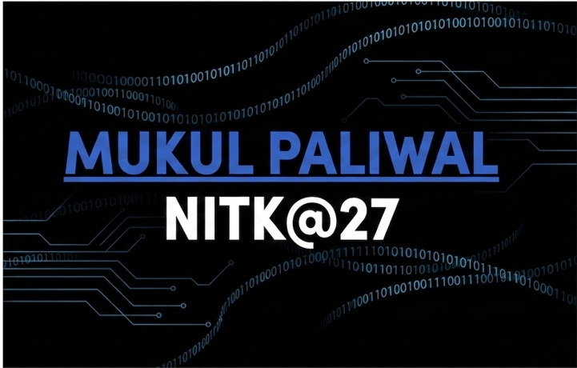

  

I am an Electrical and Electronics Engineering student at NITK Surathkal, specializing in digital design, embedded systems, and computer architecture. I thrive on building entire systems close to the hardware layer, from bare-metal operating systems and custom RISC-V processors to AXI-based IP blocks and hardware accelerators.

---

## **About Me**

* **Currently Architecting:** An FPGA-based MNIST digit recognition accelerator and a bare-metal OS for the Raspberry Pi 2.
* **Deep Diving Into:** SystemVerilog Verification methodologies, FPGA acceleration pipelines, and advanced Data Structures and Algorithms.
* **Open to Collaborating On:** Open-source SoC design, custom hardware accelerators, and low-level embedded AI/ML hardware.

---

## **Projects**

**Digital Design and Hardware Acceleration**

* **FPGA-based MNIST Handwritten Digit Recognition Pipeline**
  I built an entire pipeline, from camera interface to display. I implemented preprocessing, grayscale conversion, flattening, and a custom neural network inference core. Verified using a custom testbench with Cocotb and Python within the Xilinx Vivado environment.

* **AXI-compliant LFSR IP Core**
  Created a complete AXI4-Lite and AXI4-Stream compatible IP block for pseudorandom number generation. Integrated with Block RAM and FIFOs, and verified via a standard Python AXI master testbench.

* **16-Point FFT ASIC Design Flow**
  RTL implementation of a Radix-2 DIT FFT processor. Pushed the design through synthesis, floorplanning, and Place and Route using the OpenLane ASIC flow, achieving optimal timing and area constraints.

* **CORDIC Calculator**
  Synthesizable Verilog implementation for computing fixed-point sine and cosine values, using an iterative micro-rotation algorithm.

* **Signed Booth Multiplier**
  Verilog implementation of signed binary multiplication, optimized to reduce hardware area and propagation delay.

**Analog and Mixed-Signal Design**

* **180nm CMOS Differential Amplifier**
  Designed and simulated a fully differential CMOS operational amplifier in LTspice using a 180nm technology node. Optimized circuit geometry and biasing networks to maximize differential-mode gain and Common-Mode Rejection Ratio (CMRR) while balancing power dissipation and unity-gain bandwidth constraints.

**Low-Level Systems and Embedded Infrastructure**

* **Bare-metal Operating System for Raspberry Pi 2**
  Developed from scratch without external OS support. I implemented custom UART drivers, user-to-kernel mode privilege transition protocols (handling ARM EL0 to EL1 switching, where EL0 is unprivileged user mode and EL1 is privileged kernel mode), virtual memory setup via an MMU, and an interrupt-driven syscall infrastructure.

* **RISC-V Single-Cycle and Pipelined Processors**
  Designed comprehensive datapath and control units in Verilog. Resolved pipeline stalls by engineering automated hazard-detection and forwarding logic, backed by an assembler-based test workflow.

* **ESP32 Secure NVS Data Extraction and Cryptography**
  Explored hardware security frameworks by reverse-engineering and pulling data from ESP32 Non-Volatile Storage (NVS). Engineered a secure transmission pipeline to a remote server protected by a custom, lightweight SHA-256 workflow.

* **IoT-based Smart Fan Controller**
  A low-power ESP32 ambient monitoring system utilizing real-time temperature tracking to modulate motor speeds with cloud updates.

---

## **Technical Arsenal**

| Category | Skills and Tools |
| :--- | :--- |
| **Hardware Description** | Verilog, SystemVerilog, RTL Design, ASIC Flow, STA |
| **Analog Simulation** | LTspice, CMOS Design, Circuit Analysis |
| **Low-Level Software** | C, C++, ARM Assembly, Python |
| **EDA and Verification** | Xilinx Vivado, OpenLane, Cocotb, Icarus Verilog, GTKWave |
| **Embedded Platforms** | STM32, ESP32, Raspberry Pi, FPGA Development Boards |
| **System Protocols** | AXI4, AXI4-Lite, AXI4-Stream, SPI, UART |

---

## **GitHub Insights**

  
  

---

## **Let's Connect**

* **LinkedIn:** [Connect with Mukul Paliwal on LinkedIn](https://www.linkedin.com/in/mukul-paliwal-2b2923315/)
* **Email:** mukulpaliwal2023@gmail.com

> **Fun Fact:** I once spent an agonizing number of hours debugging a bare-metal Raspberry Pi printf() function that kept mysteriously truncating output, only processing 4 characters at a time. The culprit? An unbuffered UART TX FIFO control register that I didn't poll correctly before sending successive bytes. Hardware always wins the first round.